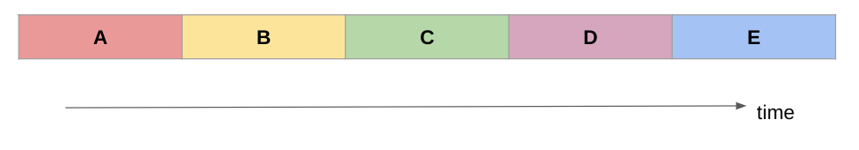
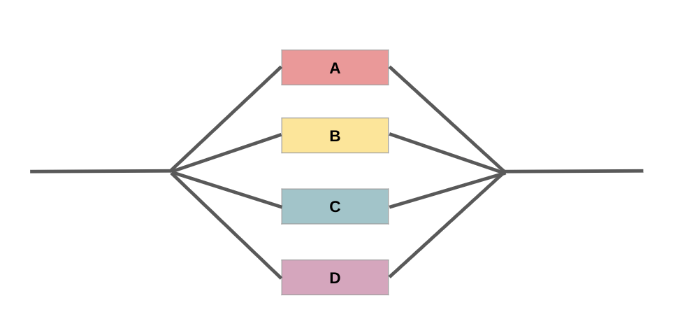

# Session 1: What is HPC?

This session introduces some concepts, theories and terminology in High Performance Computing, to set you up for going more in-depth into the theory of research computing. It then lays out the general architecture of HPC systems, with some specifics relating to Aire, the latest HPC system available at the University of Leeds.

## Some commonly used terms

Let's define some frequently used jargon. Don't worry, we will delve into each of these in more depth later.

::::{tab-set}
:::{tab-item} HPC
### HPC

- **HPC** stands for **High Performance Computing**
- HPC systems or platforms can also be called **clusters** or **supercomputers**

HPC systems allow multiple processors to work on the same problem at the same time, allowing complex problems to be solved faster than they could be on a single computer.

- Problems which might take years to run on a single processor might run 10 or 100 times faster using 10 or 100 processors in parallel, thus reducing the time to results for the researcher.
- **It’s not magic**, there is no fairy dust that can just make code run on hundreds of processors. So a lot of work and effort has to be put into using these system effectively and to get the most out of them.
- **It could transform your workflow** if you put the effort in to shape your code to work on a HPC system.

:::

:::{tab-item} Cluster
### Cluster

- Computer clusters are a system of computers that work together to allow large-scale computing
- Imagine a network of laptops hooked up together on a high speed network - each laptop is a "node" in the cluster and acts as a server
      
:::

:::{tab-item} Node
### Node

- A node is an individual physical machine/server, that when linked to other nodes makes up the cluster
- In current systems, a node would typically include one or more processors, as well as memory and other hardware.

      
:::

:::{tab-item} Processor
## Processor

The processor or **central processing unit** (CPU) inside the node, which contains one or more cores.

- Your laptop or desktop will have a CPU, for example "Intel Core i7"

Machines can also have a **graphical processing unit** or GPU (often used in machine learning)

      
:::

:::{tab-item} Core
## Core

This refers to the basic computation unit of the CPU. This is the unit that carries out the actual computations.

- You will have to define how many cores you want to run your code across.
- You can use cores across multiple nodes

      
:::

:::{tab-item} Aire
## Aire

- Aire is the University of Leeds’ latest HPC system
- It uses a Linux operating system
- The system has 52 CPU **nodes** (and 28 GPU nodes)
- Each CPU **node** has:
    - **168 cores** (ARC4 had 40 cores)
    - **768GB** memory

You can [read more about the Aire system on our website](https://arc.leeds.ac.uk/platforms/aire/)

      
:::

::::

:::{admonition} Key takeaway

HPC cluster systems are formed of a large number of separate computers called nodes.

Each node is about equivalent to a high-end workstation or server. They are linked together by a high-speed network which allows very rapid communications between the nodes.

**Read More**:

- [Getting started on HPC](https://arcdocs.leeds.ac.uk/aire/getting_started/start.html)

:::

 
 

---

## Serial and parallel programs

- Serial programs run on a single CPU core, solving one problem at a time.
- Parallel programs run across multiple CPU cores, splitting the workload between them and solving the problem faster.
- In order to use parallelism on an HPC system, you must organise your code/program to use multiple cores.

::::{tab-set}

:::{tab-item} Serial program

 

- Serial problems use a single CPU core, and solve a series of problems one after the other.
- Each stage of the calculation (A, B, C...) may depend on the output of the previous stage, or they may be independent (and so could run in any order).

:::

:::{tab-item} Parallel program

- In contrast, in a parallel program, the problems can be solved simultaneously on multiple cores.
- In this example, all the stages (A, B, C...) are independent of each other and do not require one stage to be completed before another stage begins.
- This sort of problem is known as ["perfectly parallel" or "embarrassingly parallel"](https://en.wikipedia.org/wiki/Embarrassingly_parallel) because it is a task that is "embarassingly easy" to split up into parallel tasks.

:::

:::{tab-item} Imperfectly parallel

Most tasks you run or models you run will fall somewhere in-between serial and parallel:

- Certain sections of the code will be able to be *parallelised* while other sections will rely on the output of the previous stage and so need to be serialised.
- You can express how much of your work is parallelised with a rough percentage.
- The higher the parallel portion, the more speed improvement you'll get running it on a HPC system across multiple cores.

:::

:::{tab-item} Amdahl's Law

Amdahl's law, where *Speedup = (execution time for the task with no enhancements or added cores)/(execution time for the same task with enhancements or added cores)*. [Image source](https://en.wikipedia.org/wiki/Amdahl%27s_law): Daniels220 at English Wikipedia, CC BY-SA 3.0, via Wikimedia Commons

- The greater the parallelised portion, the greater the speed-up by adding more cores
- There comes a point of diminishing returns where adding more cores has a negligble effect:
    - If 50% of the job is parallelised, the greatest speedup is 2 times
    - If 95% of the work is parallelised, the greatest speedup is 20 times.

:::

:::{tab-item} Parallelisation

## This bit is up to you!

- You are the expert in your field, your numerical models, your code
- In this course we will show you how to request multple cores from the system for your code, but *you* need to make sure your code can make use of these!
- You can always submit a request for advice and guidance on how to parallelise your work.

(If you are using Python, you can also attend our [high performance python course](https://arc.leeds.ac.uk/courses/swd6-high-performance-python/) for more information and guidance on this topic)

 

:::

::::

 
 

---

## Overview of an HPC cluster

This content is adapted from [this section of our Aire documentation](https://arcdocs.leeds.ac.uk/aire/system/hpc_architecture.html#hpc-architecture).

In the previous section, we noted that HPC systems are formed of **nodes**, and we mentioned CPU and GPU nodes.

These can be called the **compute nodes**: where your research code runs. But there are other nodes in the system! 

::::{tab-set}

:::{tab-item} Diagram

[Image source](https://arcdocs.leeds.ac.uk/aire/system/hpc_architecture.html#overview-of-an-hpc-cluster)

:::

:::{tab-item} Compute nodes

Some more detail on the compute nodes in Aire:

- Compute nodes are physical systems containing CPU and memory.
- Each compute node on Aire has 168 cores, which are the physical processing units within a CPU that execute instructions and perform calculations.
- Having many cores allows many instructions to be executed in parallel.
- There are also high-memory nodes separate from standard compute nodes for jobs that require a significant amount of memory.

:::

:::{tab-item} GPU nodes

Some more detail on the compute nodes in Aire:

- A GPU node is simply a compute node that has one or more Graphical Processing Units (or GPUs) installed on it.
- GPUs can be very powerful and allow certain programs to run faster than they do on CPUs (such as some Machine Learning and Deep Learning tools for AI applications).
- Programs have to be specially written to run on GPUs.

:::

:::{tab-item} Login nodes

These are similar to compute nodes, but they do not run jobs and they are connected directly to the University network.

- You can connect to a login node via ssh and login to it.
- You can then create and edit files and programs and run scripts and manage your data.
- You can also upload and download data from login nodes.
- You don’t use the login node to run your work, just to prepare it and to view the results. 

We will run through step-by-step how to login to the system with these nodes.

:::

:::{tab-item} Storage nodes

These nodes have large disk arrays attached to them, to deal with vast amount of data HPC systems can generate.

- Often there are multiple nodes and disk arrays which are linked together in to a large parallel filesystem.
- These parallel filesystems are geared for the very large amounts of I/O which some runs can generate. Storage nodes are not directly accessible by users.
- The data directories from the storage nodes are mounted on the login and compute nodes.

:::

:::{tab-item} Admin nodes

These aren’t accessible or visible to users, but they provide the resources and services needed to manage the cluster.

- For example, they allow system administrators to automatically install and configure the OS on all the nodes and access monitoring features.
- The job scheduler, which we will discuss later, is hosted on one of the admin nodes.

:::

::::