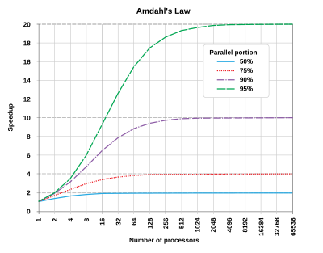

## Amdahl's Law {.center}

Understanding the limits of parallel speedup

---

## Amdahl's Law

{fig-align="center"}

**Speedup = (execution time for the task with no enhancements or added cores) / (execution time for the same task with enhancements or added cores)**

*Image source: Daniels220 at English Wikipedia, CC BY-SA 3.0, via Wikimedia Commons*

---

## Key Insights

::: {.fragment}
- The greater the parallelised portion, the greater the speed-up by adding more cores
:::

::: {.fragment}
- There comes a point of diminishing returns where adding more cores has a negligible effect:
  - If 50% of the job is parallelised, the greatest speedup is 2 times
  - If 95% of the work is parallelised, the greatest speedup is 20 times
:::

---

## Parallelisation Strategies

Different approaches to making your code run in parallel:

::: {.fragment}
### Task Parallelism
- Divide work into independent tasks
- Each processor works on different tasks
- Good for different types of calculations
:::

::: {.fragment}
### Data Parallelism  
- Same operation applied to different data
- Each processor works on subset of data
- Good for large datasets
:::

---

## Practical Implications

::: {.fragment}
**Before scaling up:**
- Profile your code to understand bottlenecks
- Identify which parts can be parallelized
- Consider the communication overhead
:::

::: {.fragment}
**When choosing resources:**
- More cores ≠ always faster
- Consider memory requirements per core
- Balance cores vs. memory vs. time
:::

---

## Real Performance Example

::: {.fragment}
**Scenario:** Image processing job with 1000 files

- **Serial:** 10 hours on 1 core
- **10 cores:** ~1.2 hours (not exactly 1 hour due to overhead)
- **100 cores:** ~8 minutes (if perfectly parallel)
- **1000 cores:** Likely slower due to overhead!
:::

---

## Next Steps {.center}

Now you understand HPC basics!

Let's learn how to actually connect and use the system.

[Continue to Session 2: Logging On →](logging-on-and-linux-recap.qmd)
