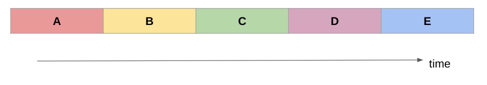
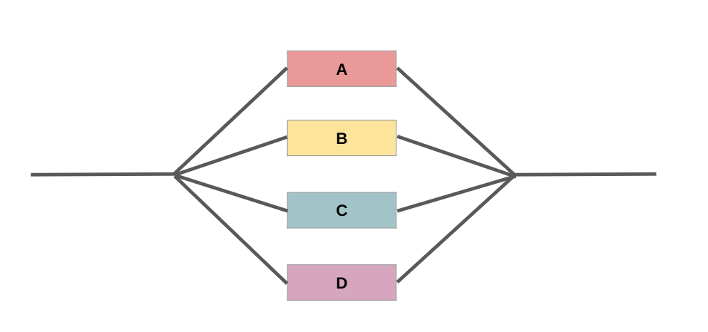

## Serial vs Parallel Programs {.center}

Understanding how programs can utilize multiple cores...

::: {.fragment}
helps us to understand how to use the HPC effectively.
:::
---

## Serial Program

{fig-align="center"}

::: {.fragment}
- Serial problems use a single CPU core
    - Solve a series of problems one after the other
- Each stage of the calculation (A, B, C...) may depend on the output of the previous stage, **or** they may be independent (and so could run in any order)
:::

---

## Parallel Program

{fig-align="center"}

In contrast: problems can be solved **simultaneously** on multiple cores

---

## Parallel Program

{fig-align="center"}

- All the stages (A, B, C...) are independent of each other and do not require one stage to be completed before another stage begins
- ["Perfectly parallel" or "embarrassingly parallel"](https://en.wikipedia.org/wiki/Embarrassingly_parallel) because it is a task that is "embarrassingly easy" to split up into parallel tasks

---

## Imperfectly Parallel

Most tasks you run or models you run on the HPC will fall somewhere in-between serial and parallel:

::: {.incremental}
- Certain sections of the code will be able to be *parallelised* while other sections will rely on the output of the previous stage and so need to be serialised
- You can express how much of your work is parallelised with a rough percentage
- The higher the parallel portion, the more speed improvement you'll get running it on a HPC system across multiple cores
:::

---

## Real-World Examples

::: {.columns}
::: {.column width="50%"}
### Perfectly Parallel
- Image processing on multiple files
- Monte Carlo simulations
- Parameter sweeps
- Independent calculations
:::

::: {.column width="50%"}
### Imperfectly Parallel
- Weather modeling
- Fluid dynamics simulations  
- Machine learning training
- Molecular dynamics
:::
:::

---

## Next Steps {.center}

Understanding parallelization theory and Amdahl's Law

[Continue to Amdahl's Law slides →](what-is-hpc-amdahl-slides.qmd)
