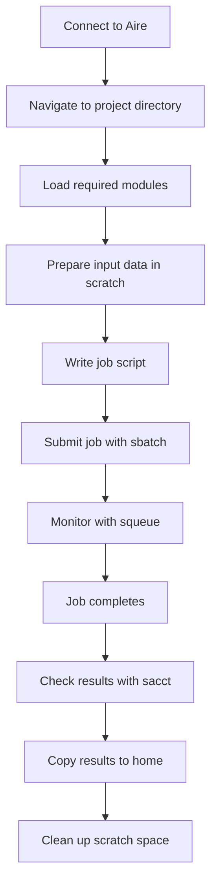

Congratulations on completing HPC1: Introduction to High Performance Computing! You've learned the fundamental skills needed to effectively use HPC systems.

## What You've Learned

Throughout this course, you've covered:

::: {.grid}
::: {.g-col-12 .g-col-md-6}
### Technical Skills
- **HPC Concepts**: Understanding clusters, nodes, cores, and parallelization
- **Linux Command Line**: Essential commands for navigating and managing files
- **Storage Systems**: Home, scratch, and temporary storage management
- **Software Management**: Using the module system and managing environments
- **Job Scheduling**: Writing and submitting SLURM job scripts
- **Best Practices**: Troubleshooting and optimizing your workflows
:::

::: {.g-col-12 .g-col-md-6}
### Key Concepts
- **Resource Planning**: Right-sizing job requests for efficiency
- **Data Management**: Organizing and protecting your research data  
- **Reproducibility**: Creating documented, version-controlled workflows
- **Collaboration**: Sharing code and environments with colleagues
- **Problem Solving**: Debugging common HPC issues
- **Security**: Protecting credentials and sensitive data
:::
:::

## Quick Reference

### Essential Commands Summary

| Category | Command | Purpose |
|----------|---------|---------|
| **Connection** | `ssh user@system` | Connect to HPC system |
| **Navigation** | `cd $HOME`, `cd $SCRATCH` | Change directories |
| **Files** | `ls`, `cp`, `mv`, `rm` | List, copy, move, remove files |
| **Storage** | `quota -s`, `du -hs` | Check disk usage |
| **Modules** | `module load`, `module list` | Manage software |
| **Jobs** | `sbatch`, `squeue`, `scancel` | Submit, monitor, cancel jobs |
| **Monitoring** | `sacct -j JOBID` | Check job accounting |

### Typical Workflow



## Next Steps in Your HPC Journey

### Immediate Actions

1. **Practice**: Try running some of your own code on Aire
2. **Explore**: Browse the available software modules
3. **Organize**: Set up a clear directory structure for your projects
4. **Backup**: Implement a data backup strategy
5. **Connect**: Join HPC user communities

### Advanced Topics to Explore

#### Parallel Programming
- **OpenMP**: Shared-memory parallelization for multi-core systems
- **MPI**: Message-passing for distributed computing across nodes
- **GPU Computing**: Using CUDA or OpenCL for GPU acceleration
- **Workflow Management**: Tools like Snakemake or Nextflow

#### Performance Optimization
- **Profiling**: Tools to identify bottlenecks in your code
- **Benchmarking**: Systematic testing of different resource configurations
- **Memory Optimization**: Techniques for handling large datasets
- **I/O Optimization**: Efficient file reading/writing strategies

#### Advanced Job Management
- **Job Dependencies**: Chaining jobs together
- **Parameter Sweeps**: Exploring parameter spaces efficiently
- **Checkpointing**: Saving and resuming long-running jobs
- **Container Technologies**: Using Apptainer/Singularity

### Learning Resources

#### University of Leeds Resources

- **[Training Courses](https://arc.leeds.ac.uk/courses/)**: Upcoming HPC and research computing courses
- **[Aire Documentation](https://arcdocs.leeds.ac.uk/aire/)**: Comprehensive system documentation
- **[Research Computing Website](https://arc.leeds.ac.uk/)**: News, updates, and resources
- **[Help Desk](https://bit.ly/arc-help)**: Submit queries and get support

#### External Learning Resources

- **[HPC Carpentry](https://hpc-carpentry.github.io/)**: Community-developed HPC training materials
- **[SLURM Documentation](https://slurm.schedmd.com/)**: Official SLURM documentation
- **[Parallel Programming Tutorials](https://computing.llnl.gov/tutorials/)**: Lawrence Livermore National Laboratory tutorials
- **[Software Carpentry](https://software-carpentry.org/)**: Programming and data skills for researchers

### Community and Support

#### Getting Help

::: {.callout-tip}
## When You Need Help

1. **Check the documentation first** - Aire docs are comprehensive
2. **Search for similar issues** - Many problems are common
3. **Ask specific questions** - Include error messages and job IDs
4. **Be patient** - HPC systems can be complex
5. **Help others** - Share your solutions with the community
:::

#### Research Computing Community

- **Research Computing Team**: [ask-rc@leeds.ac.uk](mailto:ask-rc@leeds.ac.uk)
- **Training Sessions**: Regular workshops and drop-in sessions
- **User Groups**: Connect with other researchers using HPC
- **Social Media**: Follow [@ARC_Leeds](https://twitter.com/ARC_Leeds) for updates

### Expanding Your Skills

#### Programming Languages for HPC

| Language | Strengths | Common Uses |
|----------|-----------|-------------|
| **Python** | Easy to learn, extensive libraries | Data analysis, machine learning |
| **R** | Statistical computing, visualization | Statistics, bioinformatics |
| **C/C++** | High performance, close to hardware | Computational science, simulations |
| **Fortran** | Legacy scientific code, numerical | Physics, engineering simulations |
| **Julia** | High performance, modern syntax | Scientific computing, data science |

#### Domain-Specific Tools

Explore software relevant to your research field:
- **Bioinformatics**: BLAST, BWA, GATK, R/Bioconductor
- **Chemistry**: Gaussian, VASP, GROMACS, OpenMM  
- **Physics**: LAMMPS, Quantum ESPRESSO, HOOMD-blue
- **Climate Science**: WRF, CESM, NCO tools
- **Machine Learning**: TensorFlow, PyTorch, scikit-learn

## Planning Your Next Project

### Project Checklist

Before starting a new HPC project:

- [ ] **Define objectives**: What do you want to accomplish?
- [ ] **Estimate requirements**: How much data, compute time, memory?
- [ ] **Choose tools**: What software and programming languages?
- [ ] **Plan workflow**: What are the main steps?
- [ ] **Consider scalability**: Will you need to run this many times?
- [ ] **Think about sharing**: Will others need to reproduce your work?

### Resource Planning Template

Use this template to plan your resource requests:

```bash
#!/bin/bash
# Project: [Your project name]
# Objective: [What you're trying to accomplish]
# Expected runtime: [Your estimate]
# Input data size: [Size of input files]
# Output data size: [Expected output size]
# Memory requirements: [Based on similar work or testing]

#SBATCH --job-name=[descriptive_name]
#SBATCH --partition=[appropriate_partition]
#SBATCH --time=[realistic_estimate]
#SBATCH --nodes=[number_needed]
#SBATCH --ntasks=[for_MPI] 
#SBATCH --cpus-per-task=[for_OpenMP]
#SBATCH --mem=[memory_needed]
#SBATCH --output=logs/%x_%j.out
#SBATCH --error=logs/%x_%j.err

# Load modules
module load [required_modules]

# Set up environment
export OMP_NUM_THREADS=$SLURM_CPUS_PER_TASK

# Change to working directory  
cd $SLURM_SUBMIT_DIR

# Run your analysis
[your_commands_here]
```

## Final Thoughts

### Remember the Fundamentals

As you advance in your HPC journey, remember these core principles:

1. **Start simple**: Get basic workflows working before adding complexity
2. **Test thoroughly**: Always validate your results and methods
3. **Document everything**: Your future self will thank you
4. **Be a good citizen**: Share resources fairly and clean up after yourself
5. **Keep learning**: HPC technology and best practices continue to evolve

### The Impact of HPC

High Performance Computing enables breakthrough research across many fields:
- **Climate modeling** helps us understand and predict climate change
- **Drug discovery** accelerates development of new treatments
- **Astrophysics** simulations reveal the evolution of the universe
- **Materials science** designs new materials with desired properties
- **Economics** models complex market behaviors and policies

Your research, powered by HPC, contributes to advancing human knowledge and solving important challenges.

### Thank You

Thank you for participating in HPC1: Introduction to High Performance Computing. We hope this course has given you the confidence and skills to leverage HPC systems effectively in your research.

The Research Computing team at the University of Leeds is here to support you as you continue your HPC journey. Don't hesitate to reach out when you need help, have questions, or want to share your successes!

---

## Contact Information

- **Research Computing Team**: [ask-rc@leeds.ac.uk](mailto:ask-rc@leeds.ac.uk)
- **Training**: [https://arc.leeds.ac.uk/courses/](https://arc.leeds.ac.uk/courses/)
- **Documentation**: [https://arcdocs.leeds.ac.uk/aire/](https://arcdocs.leeds.ac.uk/aire/)
- **Help Desk**: [https://bit.ly/arc-help](https://bit.ly/arc-help)

## Course Feedback

We value your feedback to improve this course. Please let us know:
- What worked well for you?
- What could be improved?
- What additional topics would be helpful?
- How will you use what you've learned?

**Happy computing!** 🚀
